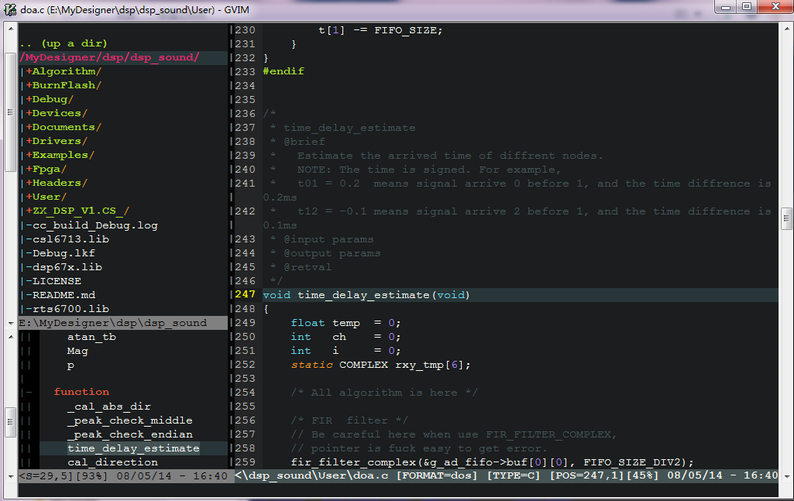

## Features
	1. 解决中文/菜单乱码
	2. 配置置状态栏，默认隐藏工具栏和菜单栏，F2快捷键可打开
	3. 快捷键：Ctrl+]执行ctags跳转，Ctrl+T返回，F12快捷键自动生成/更新tags文件,普通模式下wm在VIM左侧打开wmmanager窗口
	4. 自动补全([{等括号
	5. 自动为.c.h等插入文件头注释
	6. F3快捷键自动插入函数注释
	7. 设置中文字体为幼圆，英文字体为Courier New
	8. 语法高亮
	9. omnicppcomplete实现自动C/C++代码补全
	10. 当前行高亮
	11. 使用molokai经典TextMate主题
	12. 使用vim-markdown插件实现Markdown语法高亮等
	13. Visual模式下选择注释代码块 \cc注释 \co反注释
	14. Visual模式下选中字符串后，使用#,*,gv快捷键可快速实现文档内对选中字符串的查找
	15. 添加NERDTree插件，将NERDTree集成到winmanager窗口中
	16. 添加code_complete插件，其使用全在插入模式下+TAB快捷键完成，其功能包括：
	
		- 插入模式下cc+TAB：添加/**/格式的注释
		- 插入模式下cd+TAB：添加/**< */doxgen格式的注释
		- 插入模式下ff+TAB：头文件中添加#ifdef #define #endif防止重复包含的预处理代码
		- 插入模式下is+TAB：插入系统头文件
		- 插入模式下in+TAB：插入自定义头文件
		- main函数、if/for/switch/while等语句的自动补全，函数括号后TAB能进行函数参数提示

	17. 状态行显示echofunc函数提示：存在多个同名函数tag时，输入函数左括号后使用Ctrl+u/d快捷键切换		  
	18. 诸多其它小功能

## Plugins
    echofunc           函数参数提示
    taglist            标签
    winmanager         窗口管理 快捷键wm
    bufexplore         多文件编辑缓存管理 快捷键\be \bs \bv
    omnicppcomplete    C/C++代码自动提示
    colors/*           各种VIM主题
    vim-markdown       Markdown语法高亮 https://github.com/plasticboy/vim-markdown
    NERDTree           文件浏览器管理插件
    a.vim              .h与.c文件切换插件，通过:A命令切换
    code_complete.vim  代码补全功能，函数参数自动提示感觉很有用，虽然echofunc也提供了函数参数提示

## Key Mapping
    F2                 打开工具栏和菜单栏
    Ctrl+]             Ctags跳转 
    Ctrl+T             Ctags返回
    F12                创建或更新tags文件
    wm                 打开winmanager左侧导航窗口
    F3                 插入函数注释
    \cc                注释代码块
    \co                反注释代码块
    #,*                Visual模式下对选择字符查找
    NERDTree/o或i      从NERDTree中打开选中文件
    Ctrl+u/d           EchoFunc在状态行有多个函数tag时，切换tag

## exec
    ctags.exe          Windows环境下的ctags,放置到gvim.exe所在目录,亦可到http://ctags.sourceforge.net/下载Linux环境下默认已安装


## User Guide

### Linux(CentOS)

1.	Copy `vimfiles` directory to your home directory. Then mv directory name to `.vim` 

	```
	su root
	mv vimfiles .vim 
	cp .vim /home/monkeyzx/
	```

2.	Copy `vimrc` to `/etc/vimrc`. 

	```
	su root
	cp vimrc /etc/vimrc
	```

### Windows(GVIM 7.3)

1.	Copy `_vimrc` to GVIM install path.
2.	Copy `vimfiles` to GVIM install path.
3.	Copy ctags.exe to the same path as `gvim.exe` file.



